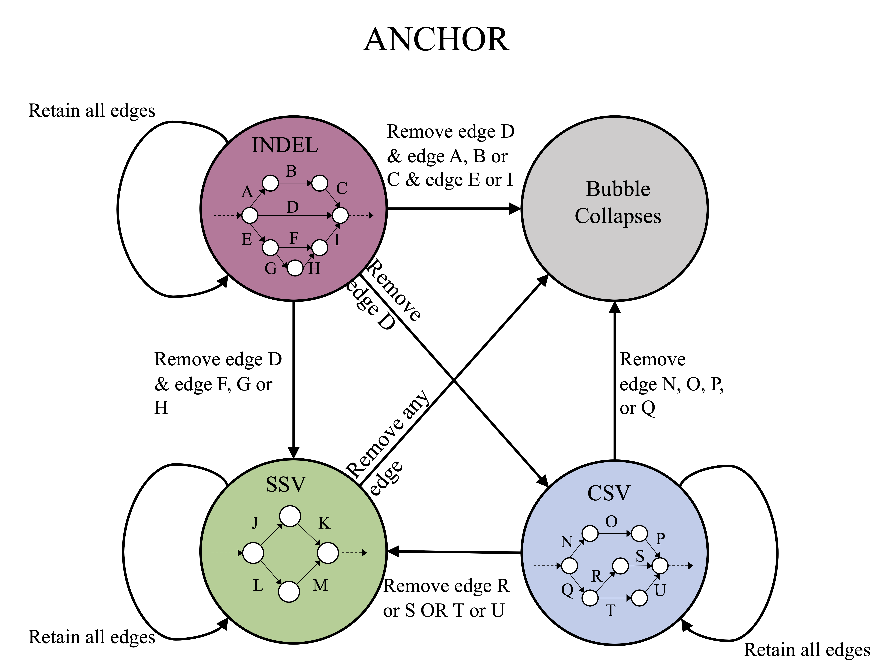

# ANCHOR

ANCHOR is a statistical method to determine the mean number of variants that would be detected if reads from one sample were down-sampled to the average sequencing depth of another sample. Briefly, ANCHOR determines the probability that each edge in a bubble, and ultimately the bubble itself, would survive at a lower depth of coverage. The algorithm runs multiple iterations, using probabilities to determine the presence of each edge in a graph and to count the number of bubbles that are retained. The survival characteristics of a bubble are not obvious (Figure 1B). For instance, after down-sampling, an indel can remain an indel, disappear, or transform into a simple or complex structural variant, depending on how the structure of the graph changes as coverage is reduced. 
<tr> 
    <p align="center"></p>
</tr>

To run ```ANCHOR``` simply include the file src/ANCHOR_Utils.py and to calculate the number of bubbles, call the function
```
ANCHOR(Graph, bubbles, p, min_matepair=3, bootstrap = 1000)
Where,
Graph is the oriented.gml obtained from running MetaCarvel
bubbles is the list of bubbles (bubbles.txt) obtained from running  MetaCarvel
p = NL/NH, where NL is the number of reads to downsample to and NH is the number of reads in the observed sample. 
```
